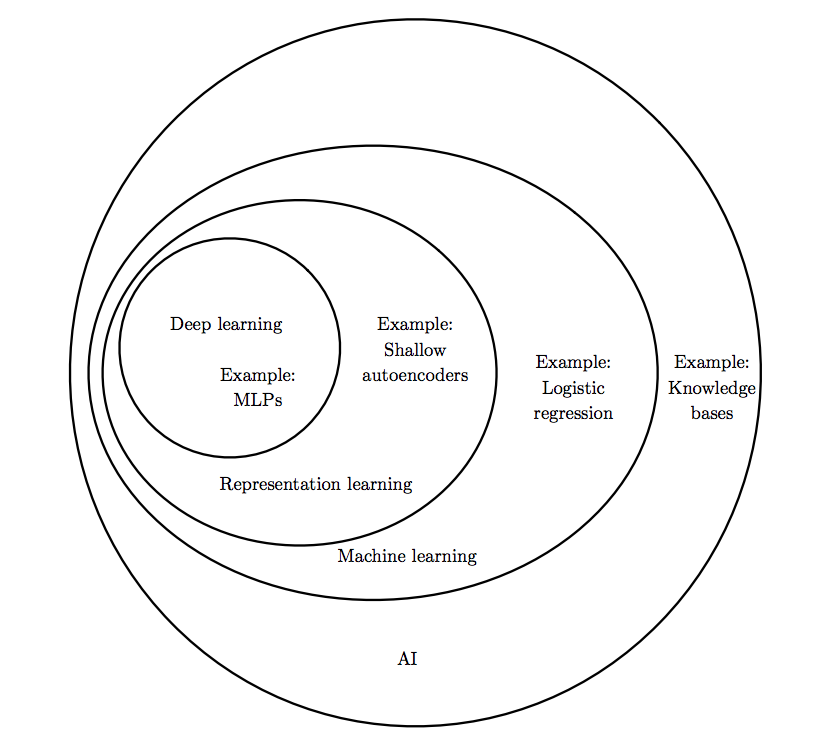
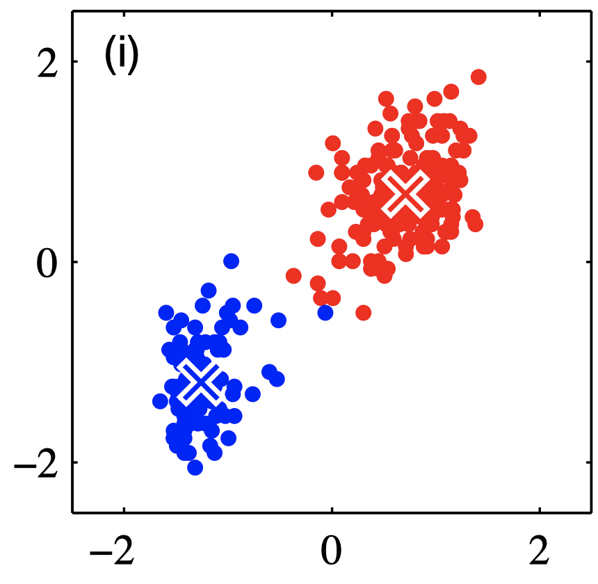

## Summary

* We provide an architecture-oriented definition of data mining.
* We explain key ML terms.

## What is data mining?

According to wikipedia, data mining is the process of discovering patterns in large data sets involving methods at the intersection of machine learning, statistics, and database systems. Data mining is an interdisciplinary subfield of computer science and statistics with an overall goal to extract information from a data set and transform the information into a comprehensible structure for further use.

*Data Mining Positioning*

## ML Key Terms
 The performance of simpler machine learning algorithms depends heavily on the **representation** of the data they are given.  Each piece of, relevant to the problem, information that is included in the representation is known as a **feature**.

Modern ML systems **learn** the most suitable representations (still with a some help from data scientists) - an example is shown in the picture below. 

*Hierarchical Feature Learning*

In **supervised** learning we present a training set $\{ \mathbf{x}_1, \dots, \mathbf{x}_N \}$ together with their labels, the target vectors $\mathbf{y}$. 

*Examples from the MNIST training dataset*

Our task is to construct a model such that a suitably chosen loss function is minimized for a *different* set of input data, the so-called test set. The ability to correctly *predict* / *classify* when observing the test set, is called **generalization**.
 

*Birdseye view of home prices - Zillow predicts prices for similar homes in the same market.*

In unsupervised learning, we present a training set $\{ \mathbf{x}_1, \dots, \mathbf{x}_N \}$  without labels. We construct a partition of the data into some number $K$ of **clusters**, such that a suitably chosen loss function is minimized for a *different* set of input data, the so-called test set.

*Clustering showing two classes and the exemplars per class*

## A typical AI stack today

As we have seen from the [syllabus](docs/syllabus), this course approaches supervised and unsupervised learning methods from an applied perspective - this means teaching concepts but at the same time looking how these concepts are applied in the industry to solve real world problems. In this respect here we take an architecture driven definiition of data mining, presenting the components of data mining in a form of a software stack but also how the components are mechanized in what we call **ML Pipelines** to provide the ML utility to applications. For a complete overview of real world ML pipelines used today go through the [TFX](http://stevenwhang.com/tfx_paper.pdf) paper in its entirety.

*AI Stack circa 2019*

### Landscape of the AI ecosystem
Due to the complexity and common interest to addresses industrial players are partnering to define and implement the necessary components for the complete automation of AI pipelines.  This work is going in within the Linux Foundation and Deep Learning Foundation amongst many other open source communities.

<section class="bg-apple">
              

                  <h2>Linux Foundation - Deep Learning Foundation</h2>
          <iframe width="2120" height="630" src="https://landscape.lfdl.io/format=landscape&fullscreen=yes" frameborder="0" allowfullscreen></iframe>
          

</section>

[Deep Learning Foundation ecosystem.](https://landscape.lfdl.io/format=landscape&fullscreen=yes)
 

## The four pipelines of an end to end data mining platform

*Example of end to end pipeline - serial arrangement*

*Example of Data Pipeline*

*Example of Model Training Pipeline*

*Example of Model Evaluation and Validation Pipeline*

*Example of Serving Pipeline*

